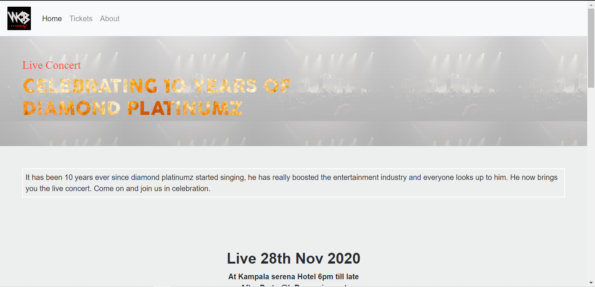
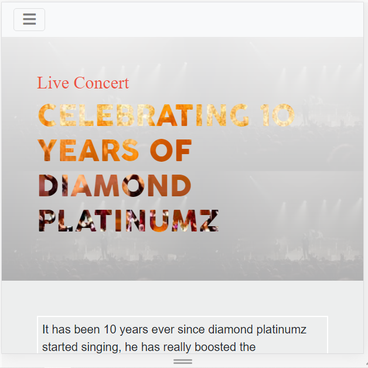

# HTML-CSS-capstone-project-Concert-Page

This project is the capstone project of in the HTML/CSS module at Microverse. The Main goal was to build an online website for an event. I chose an HTML/CSS bootcamp.

I've worked on all the requirements given on this project.

- Used the clients' colours, layouts and design guidelines.
- Aligned some elements with float and flex or grid.
- Used semantic HTML elements for the header, the main content and the footer.
- Styled the elements to look like the given design.
- Used Bootstrap.

## Desktop

## Mobile 

## Built With
- Vs Code
- Linters
- HTML5
- CSS3 (Flex and media queries)
- Sass
- Bootstrap

## Live Demo

[Live Demo Link](https://byabasaija.github.io/Concert-page-Capstone-Project/)

[Presentation Link](https://www.loom.com/share/387464dffdcb495096d88c350abc8a1b)

## Authors

👤 **Byabasaija**

- GitHub: [@Byabasaija](https://github.com/daviidy)
- Twitter: [@Pascal](https://twitter.com/DavidYao3)
- LinkedIn: [@Pascal Byabasaija](https://www.linkedin.com/in/david-yao-6bb95299/)

## Acknowledgement

I have followed the [design](https://www.behance.net/gallery/29845175/CC-Global-Summit-2015) given by [Cindy Shin in Behance](https://www.behance.net/adagio07)

## 🤝 Contributing

Contributions, issues, and feature requests are welcome!
